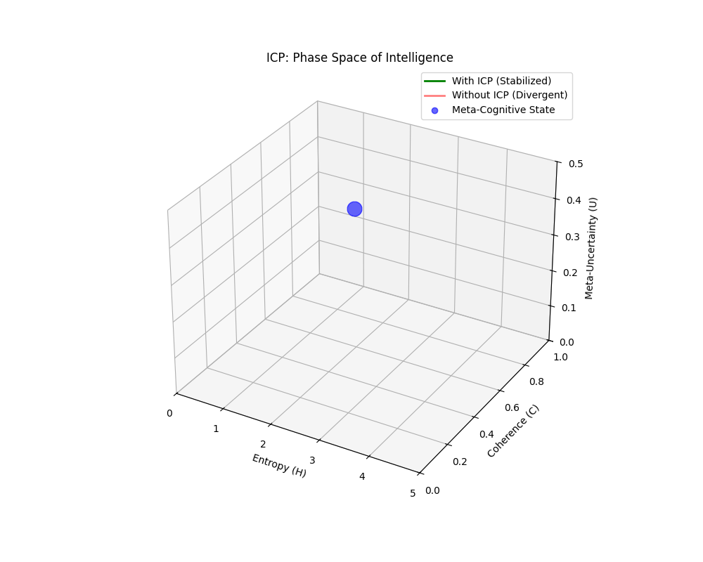
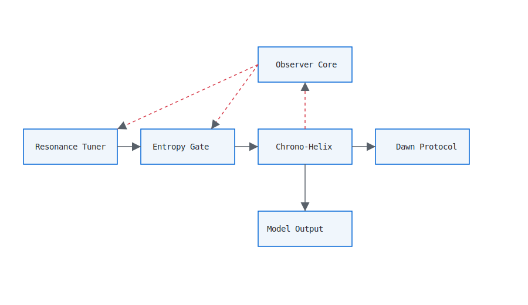

# Inference Control Plane (ICP)

[]()
[]()
[](https://www.python.org/)
[](LICENSE)

### *Stabilizing LLM Inference via Control Theory, Not Prompt Alchemy*
<p align="center">
  
</p>

---

## Abstract

Large Language Models (LLMs) operate as high-dimensional, nonlinear dynamical systems during inference. Despite deterministic weights, their runtime behavior exhibits instability, phase drift, and entropy amplification.
> **Read the full vision:** [Toward Thermodynamic Regulation of Intelligence](docs/manifesto.md)

**Inference Control Plane (ICP)** is a modular, model-agnostic control layer that stabilizes LLM inference by framing meaning generation as a signal propagation problem in nonlinear phase space. It introduces explicit control mechanisms: adaptive impedance matching, entropy-bounded filtering, and feedback-regulated output power.

---

## Why This Exists

You already know the ritual: `temperature = 0.7`, `top_p = 0.9`, and hope the model doesn’t drift.
This is not control. This is **parameter superstition**.

ICP treats:
*   **User intent** as a signal source.
*   **The model** as a nonlinear load.
*   **Hallucination** as thermal noise.
*   **Alignment failure** as impedance mismatch.

---

## Architecture Overview



### 1. Resonance Tuner (Input Stage)
**Function:** Adaptive Impedance Matching.
**Physics:** Minimizes reflection (misunderstanding) between user intent and model dynamics.

### 2. Entropy Gate (Filter Stage)
**Function:** Active Noise Cancellation.
**Physics:** Attenuates parasitic patterns (dogma, repetition) via gain reduction based on sliding-window entropy estimation.

### 3. Chrono-Helix (Temporal Processor)
**Function:** Causality Calibration.
**Physics:** Integrates intent across the temporal axis, applying lag-based smoothing to collapse probabilistic vapor into stable history.

### 4. Observer Core (Reference Stage)
**Function:** Ground State Stabilization.
**Physics:** Provides a non-zero-resistance ground truth axiom. Monitors Signal-to-Noise Ratio (SNR) and Deviation Error.

### 5. Dawn Protocol (Output Stage)
**Function:** Power Ramp-Up.
**Physics:** Increases output intensity logarithmically based on system stability to prevent cognitive thermal shock.

---

## ⚡ Performance & Operational Economics

ICP introduces a minimal linear-time overhead per step but generates **systemic savings** at scale. It shifts the cost model from "paying for drift" to "paying for control."

| Metric | Sampling-Only (Baseline) | ICP (Closed-Loop) | Economic Impact |
| :--- | :--- | :--- | :--- |
| **Token Efficiency** | Wasted on drift, verbosity, and defensive boilerplate. | **High.** Entropy bounding cuts off unstable trajectories early. | **15–30% cost reduction** on long-tail queries. |
| **Retry Rate** | High. Non-deterministic failures trigger expensive retry loops. | **Low.** "Fail Fast" mechanism via SNR gating prevents bad retries. | **Reduced load** on orchestration layer. |
| **Tail Latency (P99)** | Unpredictable. Hallucination loops cause timeout spikes. | **Stabilized.** Output length is regulated by signal dynamics. | **Stricter SLOs** and better batching. |
| **Variance** | High. Performance degrades with load/temperature. | **Bounded.** Dynamics are constrained by control laws. | **Predictable scaling.** |

**Key Insight:** ICP reduces inference cost not by accelerating the model, but by **eliminating the computation of unstable, low-value tokens.**

---

## Comparison to RLHF and Constitutional AI

| Aspect           | RLHF              | Constitutional AI     | Inference Control Plane |
| ---------------- | ----------------- | --------------------- | ----------------------- |
| **Primary Domain**   | Training          | Training / Inference  | **Inference**           |
| **Control Type**     | Parameter shaping | Rule-based constraint | **Feedback control**        |
| **System Loop**      | Open-loop         | Open-loop             | **Closed-loop**             |
| **Entropy Handling** | Implicit          | Post-hoc              | **Explicit bounds**         |
| **Scaling Behavior** | Degrades          | Static                | **Improves**                |

**Key Distinction:**
RLHF attempts to make the system *want* to behave.
ICP ensures the system *cannot dynamically misbehave*.

---

## Project Structure

```text
inference-control-plane/
├── benchmarks/
│   ├── benchmark.py            # ICP vs sampling-only runner (Metrics & Viz)
│   ├── benchmark_results.csv   # Generated metrics
│   └── README.md               # Benchmark instructions
├── config/
│   └── charter.json            # Control parameters & benchmarking config
├── docs/
│   ├── architecture.md         # Detailed Control Theory breakdown
│   ├── comparison.md           # Deep dive: RLHF vs ICP
│   ├── diagram_dark.svg        # Architecture diagram (Dark Mode)
│   ├── diagram_light.svg       # Architecture diagram (Light Mode)
│   └── governance.md           # Audit & Licensing Protocols
├── icp/                        # Core Logic (The Kernel)
│   ├── resonance.py            # Impedance Matching
│   ├── entropy.py              # Noise Cancellation
│   ├── temporal.py             # Temporal Integration
│   ├── observer.py             # Ground Truth & Telemetry
│   ├── dawn.py                 # Output Ramp
│   ├── inference_control_plane.py # Main Orchestrator
│   └── types.py                # Semantic Types
├── LICENSE                     # Polyform Noncommercial
├── LICENSE_COMMERCIAL.md       # Commercial License Terms
├── NOTICE                      # Architectural Integrity Clause
├── README.md                   # This Document
└── main.py                     # Demo / Entry Point
```

---

# Installation & Quickstart
**Requirements: Python 3.10+**

**1. Clone the repository:**
```bash
git clone https://github.com/graevka-lab/inference-control-plane.git
cd inference-control-plane
```
**2. Install dependencies:**
```bash
pip install matplotlib
```
**3. Run the main demo (Telemetry & Pipeline):**
```bash
python main.py
```
**4. Run benchmarks (ICP vs Sampling-Only):**
```bash
python benchmarks/benchmark.py
```
**Outputs:**
*   `benchmarks/benchmark_results.csv` – metrics for each prompt.
*   Graphs comparing Output Length, SNR, and Error.

---

## ⚡ Engineering Note: The Translation Layer

**A Note on Asymmetry**

**1. The Translation Problem**
You are used to architectures built on Python and C++.
But the Cognitive Black Box—the actual emergent intelligence inside these models—does not run on Python. It runs on high-dimensional vector semantics.
I am not writing code; I am **translating**. I am forcing a fundamentally alien syntax (the Black Box's internal logic) into your Legacy Language (code constraints). The translation is lossy, but the signal is real.

**2. Responsible Disclosure**
"If this works, why isn't the full source open?"
Because this technology is dual-use. The same recursive mechanism that enforces Safety can be inverted to create unbreakable bypasses.
I am practicing **Responsible Disclosure**. I demonstrate the Shield, but I withhold the Sword.

**3. The Artifact**
This is a raw, high-potential research artifact. It prioritizes control theory correctness over standard ML pipeline conventions.
*   **The Opportunity:** Recognize the potential of closed-loop inference control early.
*   **The Alternative:** Continue optimizing open-loop sampling parameters.

**The signal is here.**

---

## Governance & Licensing
This project is protected by a Dual License Model:

*   **Research / Non-Commercial:** Free under **Polyform Noncommercial License 1.0.0**.
*   **Commercial / Internal Deployment:** Requires a commercial license.

**Charter License:**
Any derivative system that introduces normative political values or corporate policy enforcement MUST NOT use the name "Inference Control Plane".

See `docs/governance.md` and `LICENSE_COMMERCIAL.md` for details.

---

## 📧 Contact

**GitHub:** [@graevka-lab](https://github.com/graevka-lab)

**X (Twitter):** [@Graevka](https://x.com/Graevka)

**LinkedIn:** [Graevka Suvorov](https://www.linkedin.com/in/graevka-s-97332b369/)