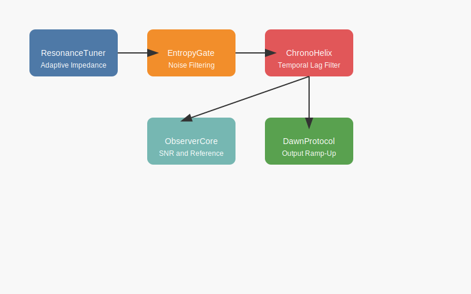

# Inference Control Plane (ICP): Architecture

## Executive Summary

Inference Control Plane (ICP) is a **closed-loop control layer for LLM inference**.
It does not modify model weights, training procedures, or sampling algorithms.
ICP operates strictly at inference time and introduces **explicit feedback control**
over signal stability, entropy, and output power.

The system is designed to address a core industry gap:
> Sampling-based inference lacks stability, observability, and control guarantees.

ICP reframes inference as a **control problem**, not a prompting problem.

---

## Design Principles

1. **Inference ≠ Training**
   Stability failures during inference cannot be fully solved at training time.

2. **Control over Optimization**
   ICP constrains system dynamics instead of optimizing preferences.

3. **Closed-Loop by Construction**
   All decisions are observable, measurable, and auditable.

4. **Model-Agnostic**
   ICP treats the model as a nonlinear load, not as a policy engine.

---

## System Overview

ICP consists of five deterministic modules arranged in a closed-loop topology:

1. Resonance Tuner  
2. Entropy Gate  
3. Chrono-Helix  
4. Observer Core  
5. Dawn Protocol  

Feedback is continuous and explicit.

---

## Module Responsibilities

### 1. Resonance Tuner (Input Stage)

**Function:** Adaptive impedance matching between user intent and model dynamics.

**Problem Addressed:**
- Prompt-model mismatch
- Early semantic reflection
- Misinterpretation amplification

**Key Property:**
- Adjusts internal impedance, not the signal content.

---

### 2. Entropy Gate (Filter Stage)

**Function:** Entropy-bounded noise suppression.

**Problem Addressed:**
- Repetitive patterns
- Policy boilerplate
- Degenerate sampling artifacts

**Key Property:**
- Entropy is measured, not assumed.
- Filtering activates only beyond explicit bounds.

---

### 3. Chrono-Helix (Temporal Integration)

**Function:** Temporal lag filtering to reduce oscillation and improve sequence coherence.

**Problem Addressed:**
- Token-level instability
- Step-to-step semantic jitter
- Overreaction to local variance

**Key Property:**
- Introduces minimal state (short history).
- No long-term memory or personalization.

---

### 4. Observer Core (Reference & Telemetry)

**Function:** Stability assessment and system observability.

**Metrics:**
- Signal-to-noise ratio (SNR)
- Output deviation error
- Signal power

**Key Property:**
- Observer does not modify content.
- It gates continuation based on stability only.

---

### 5. Dawn Protocol (Output Control)

**Function:** Output power regulation.

**Problem Addressed:**
- Abrupt overconfidence
- Cognitive overload
- Runaway verbosity

**Key Property:**
- Output amplitude scales with measured stability.
- Prevents unstable high-gain responses.

---

## What ICP Is Not

- Not alignment via values
- Not policy enforcement
- Not preference optimization
- Not jailbreak prevention via censorship

ICP does not decide *what* to say.
ICP constrains *how* inference behaves.

---

## Why This Matters for Industry

ICP introduces:
- Deterministic control surfaces
- Telemetry-first inference
- Auditability without retraining
- Separation of intelligence and stability

This enables safer scaling **without increasing model size or training cost**.

---

## Licensing Note

Commercial deployment requires a license.
See `LICENSE_COMMERCIAL.md` for details.
